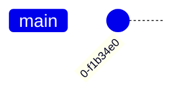

# fiplan
Sistema Financeiro do Estado de Mato Grosso

## Objetivo

Trata-se de um sistema de auxílio ao controle orçamentário e de despesa de MT.

## Fluxo de Trabalho

```mermaid
gitGraph
  commit
```
